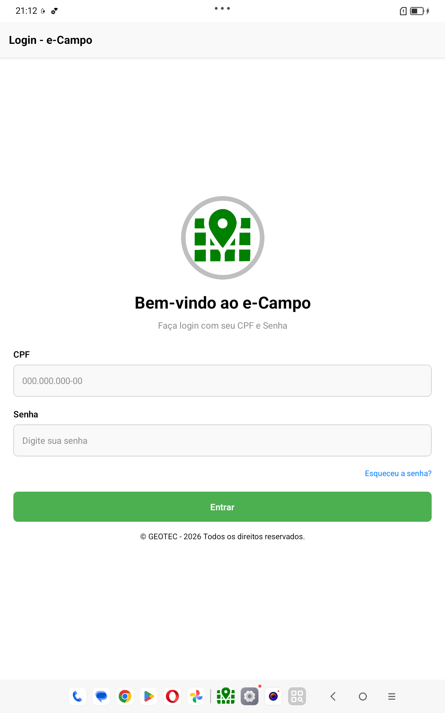
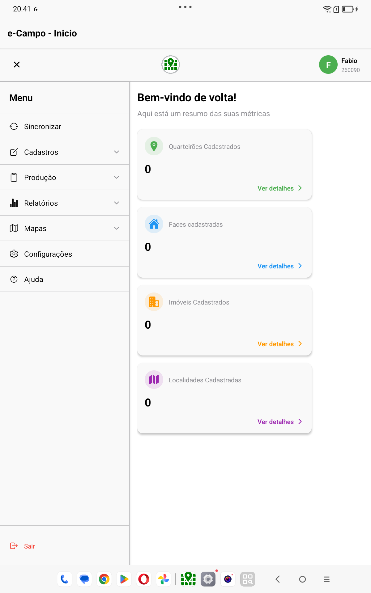
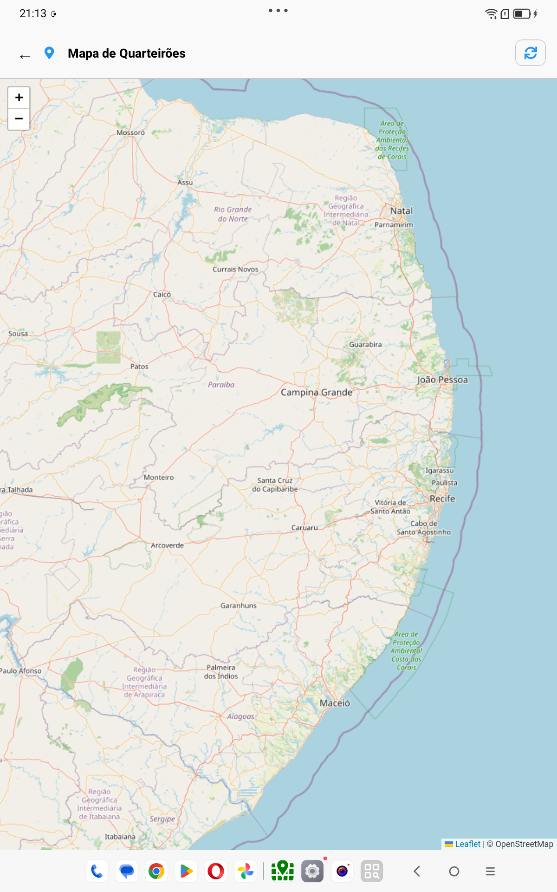
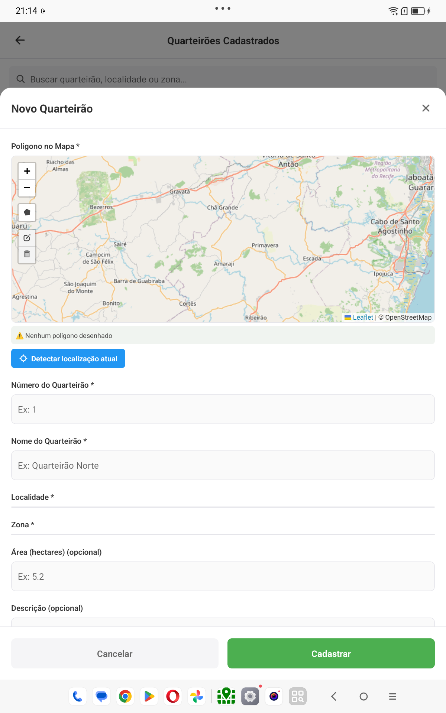
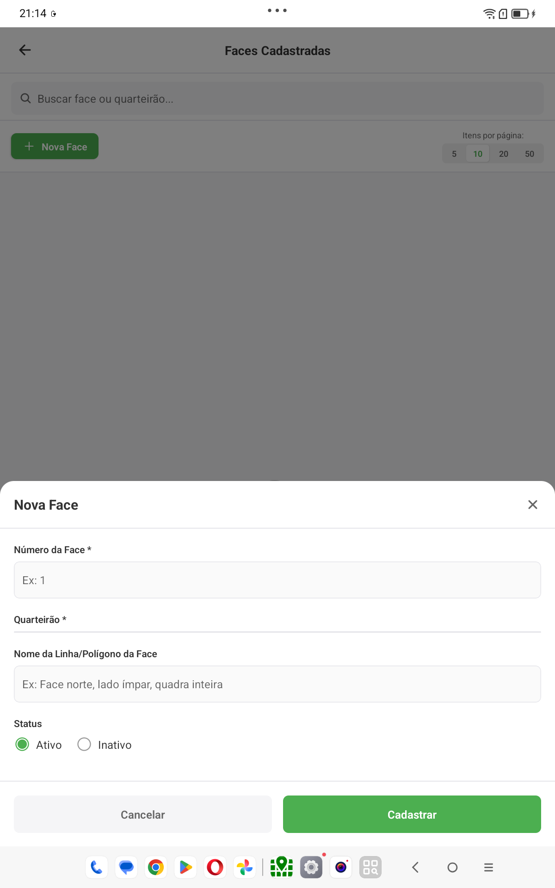

  

<h1 align="center">🌿 eCampo</h1>

  <strong>Gestão inteligente para operações de campo</strong> 
  Mobilidade, organização territorial, visualização geográfica e controle operacional em um só app.

---

# 📌 Sobre o Projeto

O **eCampo** é uma solução mobile desenvolvida para apoiar operações de campo com mais organização, mobilidade e inteligência geográfica.

A plataforma foi pensada para facilitar o dia a dia de equipes que precisam **consultar, cadastrar, visualizar e acompanhar informações territoriais e operacionais diretamente no dispositivo móvel**, oferecendo uma experiência prática, moderna e eficiente.

---

# 🚀 Proposta da Solução

O eCampo foi criado para transformar processos de campo em uma experiência digital mais organizada, visual e acessível.

Com ele, é possível:

- 📍 visualizar informações geográficas em mapa
- 🧭 organizar áreas por quarteirões, faces e imóveis
- 📝 registrar dados operacionais com agilidade
- 📊 acompanhar informações de forma estruturada
- 📂 centralizar dados em um ambiente digital
- 📱 utilizar o sistema em uma interface voltada ao uso mobile

---

# ✨ Principais Destaques

## ✅ Interface Mobile
O sistema foi projetado para uso em dispositivos móveis, com navegação intuitiva e acesso rápido às principais funcionalidades.

## ✅ Organização Territorial
A estrutura do projeto permite organizar dados por:
- quarteirões
- faces
- imóveis
- localidades
- zonas

## ✅ Visualização em Mapa
O app conta com módulos visuais que ajudam na leitura espacial das informações e no entendimento do território.

## ✅ Cadastro Estruturado
As informações são registradas de forma organizada, com fluxo prático e adaptado à operação de campo.

## ✅ Visão Operacional
O sistema centraliza os dados e permite melhor acompanhamento das informações registradas.

---

# 🧩 Funcionalidades do App

## 🔐 Autenticação e Acesso
O aplicativo possui área de login para identificação do usuário e acesso ao ambiente operacional.

**Destaques:**
- login de usuário
- ambiente personalizado
- acesso organizado às funcionalidades do sistema

---

## 🏠 Dashboard Inicial
A tela inicial oferece uma visão clara das principais áreas do sistema, facilitando o acesso rápido às funções mais utilizadas.

**Destaques:**
- navegação simples
- atalhos rápidos
- visão geral do ambiente
- acesso centralizado aos módulos

---

## 🗺️ Módulo de Mapas
A visualização geográfica é um dos grandes diferenciais do eCampo, permitindo um entendimento mais visual e estratégico da área de atuação.

**Destaques:**
- exibição de registros em mapa
- apoio visual à operação
- melhor interpretação espacial dos dados
- leitura mais intuitiva do território

---

## 🧱 Cadastro de Quarteirões
Permite registrar e organizar quarteirões dentro da estrutura territorial da operação.

**Destaques:**
- cadastro por nome e número
- vínculo com localidade e zona
- observações complementares
- associação com dados geográficos

---

## ↔️ Cadastro de Faces
As faces complementam a organização do quarteirão, trazendo mais detalhamento da área cadastrada.

**Destaques:**
- vínculo com quarteirão
- orientação e informações adicionais
- organização territorial mais precisa

---

## 🏘️ Cadastro de Imóveis
O sistema também permite cadastrar imóveis associados às áreas registradas.

**Destaques:**
- vínculo com quarteirão e face
- classificação do imóvel
- registro de informações complementares
- apoio ao controle territorial

---

## 📍 Gestão de Localidades
As localidades ajudam a estruturar melhor os dados e facilitam a segmentação das informações dentro do sistema.

**Destaques:**
- organização por localidades
- melhor filtro de dados
- apoio à navegação e consulta

---

## 📈 Relatórios e Acompanhamento
O projeto conta com telas voltadas à visualização consolidada e acompanhamento das informações registradas.

**Destaques:**
- visão geral dos dados
- acompanhamento operacional
- apoio à gestão e análise

---

## 🌾 Controle de Produção
O sistema contempla também uma estrutura para acompanhamento de informações de produção e histórico operacional.

**Destaques:**
- controle de informações complementares
- histórico operacional
- acompanhamento evolutivo dos registros

---

# 📸 Demonstração do App

> **Substitua os blocos abaixo pelos prints reais das telas do sistema.**  
> Você pode manter essa estrutura e só trocar os caminhos das imagens.

---

## 🔑 Tela de Login

  

---

## 🏠 Tela Inicial / Dashboard

  

---

## 🗺️ Tela de Mapas

  

---

## 🧱 Tela de Cadastro de Quarteirão

  

---

## ↔️ Tela de Cadastro de Face

  

---

## Video de funcionamento

  

  ▶️ Clique na imagem para assistir à demonstração do projeto

---

# 🧠 Diferenciais do Projeto

## 📱 Mobilidade
O eCampo aproxima a tecnologia da rotina operacional, levando a gestão para a palma da mão.

## 🗺️ Visão Geográfica
A presença do mapa fortalece a análise espacial e melhora a compreensão do território.

## 🧱 Estrutura Organizada
A divisão por quarteirões, faces, imóveis, localidades e zonas traz mais clareza ao processo.

## ⚡ Agilidade Operacional
As telas foram pensadas para oferecer rapidez no acesso às informações e praticidade na navegação.

## 📊 Apoio à Gestão
A organização e consolidação dos dados ajudam na análise e no acompanhamento das atividades.

---

# 🎯 Benefícios da Solução

- ✅ mais organização das informações
- ✅ mais controle operacional
- ✅ melhor leitura territorial
- ✅ mais agilidade para equipes em campo
- ✅ maior visibilidade dos dados
- ✅ modernização de processos operacionais

---

# 🏆 Aplicações do Projeto

O eCampo pode ser aplicado em cenários que demandam:

- gestão territorial
- controle de campo
- acompanhamento de equipes externas
- coleta estruturada de dados
- visualização geográfica
- organização de informações operacionais

---

# 📌 Resumo Executivo

O **eCampo** é uma solução mobile voltada à gestão de campo, unindo **cadastro estruturado, organização territorial, visualização em mapa e acompanhamento operacional** em uma experiência moderna e prática.

O projeto foi concebido para apoiar operações que exigem mobilidade, clareza visual e controle das informações, oferecendo uma base sólida para evoluir processos e ampliar a eficiência das equipes.

---

# 🌿 eCampo

  <strong>Tecnologia aplicada à operação em campo.</strong> 
  <strong>Mais mobilidade, mais organização, mais visão territorial.</strong>

